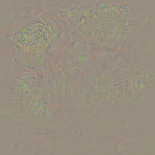
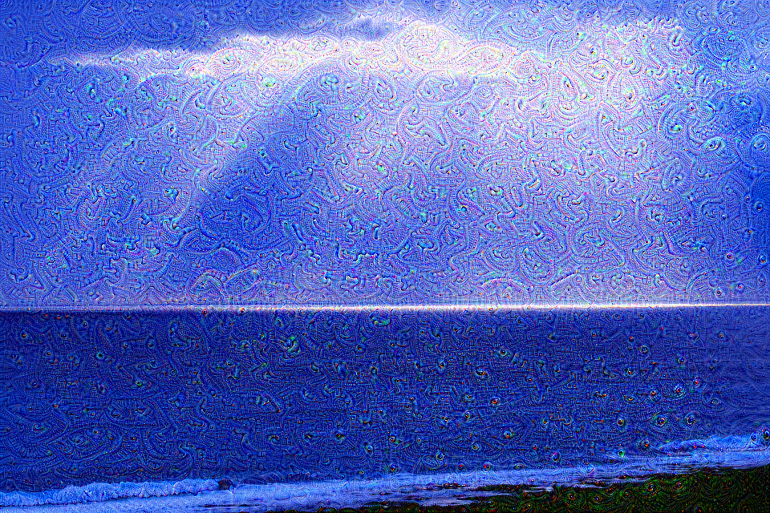
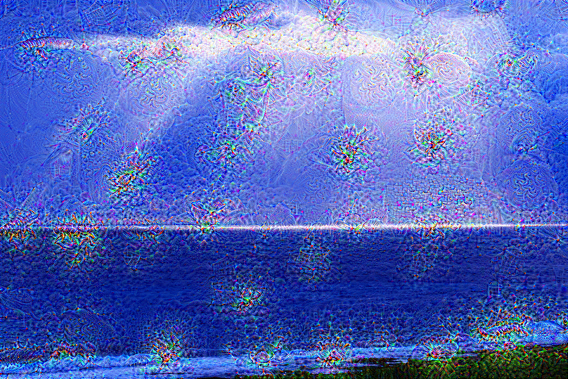
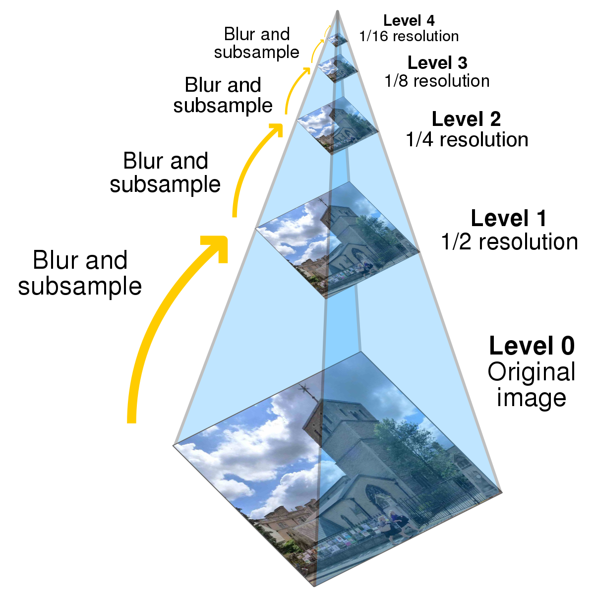
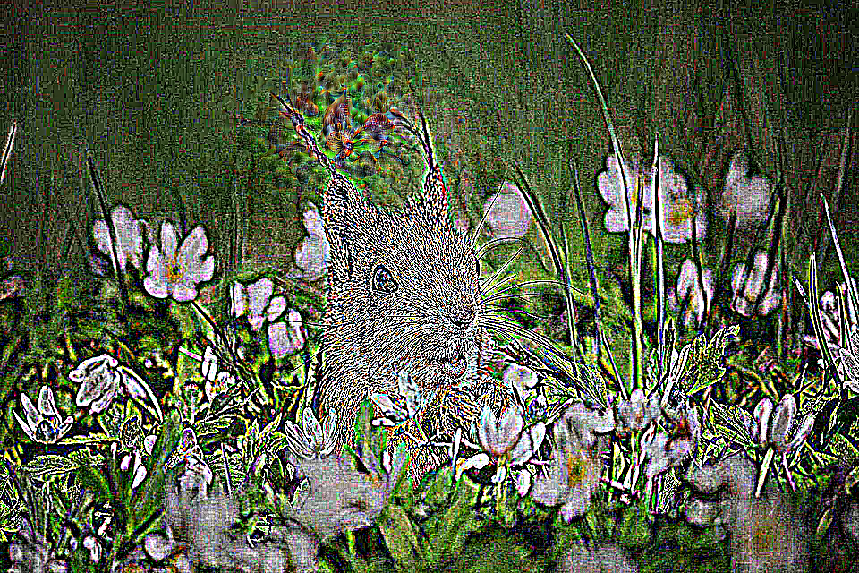
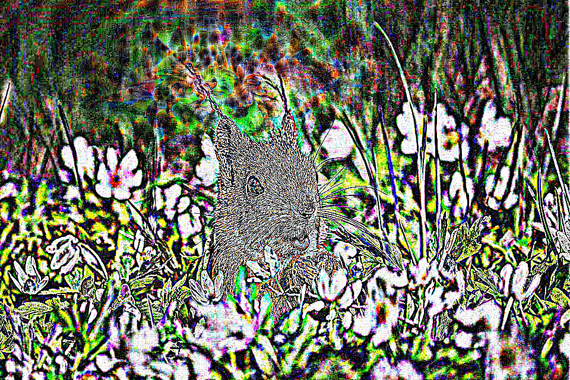

# deep-dream

## Class model visualization

Class model visualization is a technique that involves using a pre-trained vision classification network to generate an image that represents a particular class. To achieve this, the class score or logit of a given class is calculated for an input image. An optimization procedure is then used to generate the representative image by maximizing the class score. As described by the paper [Deep Inside Convolutional Networks: Visualising Image Classification Models and Saliency Maps](https://arxiv.org/pdf/1312.6034.pdf) The optimization objective can be expressed by the following equation: 

$I_g=argmax_I(S_c(I) - \lambda||I||_2^2)$


The class logits are used instead of the class probabilities of the softmax layer since the maximization of the class posterior can be achieved by minimizing the score for other classes.

Starting from a noise image, gradient ascent is used to generate a class image.

### Results - Model : alexnet

This is an example of an image that can be obtained by maximizing the logit corresponding to the ImageNet class green snake.

target class : Green Snake
<span style="color:green;font-weight:300;font-size:10px">

<div align="center">
    
</div>
</span>

## Deep Dream

Deep dream is a technique used to produce images that maximize the activations of selected layers in convolutional neural networks. The resulting image can be used to visualize the features learned by convolutional neural network.


After choosing a layer, the image is gradually changed to maximize the activations

$I = argmax_I(||FlattenedFeatures_{Layer}(I)||_2$

The deep dream technique was first introduced in 2015 by Google's Alexander Mordvintsev [Inceptionism: Going Deeper into Neural Networks](https://blog.research.google/2015/06/inceptionism-going-deeper-into-neural.html). It was used to better understand the features learned by convolutional neural networks. The observable effect is that generally, shallower layers tend to produce certain features in images such as (circles, lines ...) while deeper layers that see more of the image recognize higher-level features such as (eyes, faces ...).


#### Results | vgg19 - model

Model : Vgg19 | Layer : 5 - 12 | Iterations 100

<span style="color:white;font-weight:300;font-size:10px">

<div align="center">
    
    
</div>
</span>


### Enhancing the effect

#### Image pyramid

An image processing technique known as Image Pyramid is used in deep dreaming applications to enhance the observed effect. 

The image is represented as a pyramid of images of different resolutions. Gradient ascent iterations are performed starting from the lowest resolution image, and the details of the current step are added to the image to be processed next.

<span style="color:white;font-weight:300;font-size:10px">

<div align="">
    

</div>
</span>

This structured representation of an image is useful in many tasks (such as search and image processing) since the nodes at each level of the pyramid represent information that is localized in both space and spatial frequency.


#### Results | vgg19 - model

Model : Vgg19 | Layer : 12 | Num Octaves 3 - 8 | Iterations 20

<span style="color:white;font-weight:300;font-size:10px">

<div align="center">
    
    

</div>
</span>


### Usage

#### Install the requirements
```
pip install -r requirements.txt
```

#### Generate class image
```
PYTHONPATH=. python class_image.py --class IMAGENET_CLASS
```

#### Dream effect on image

```
PYTHONPATH=. python deep_dream.py --image IMAGE_PATH --octaves NUM_OCTAVES --iterations NUM_ITERATIONS
```

